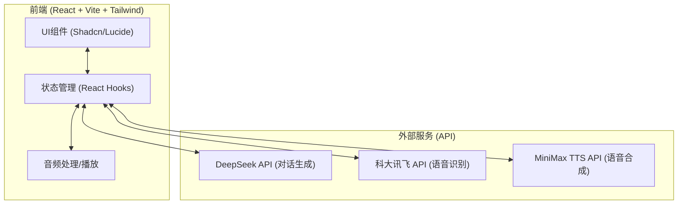

## 1. 架构设计

## 2. 技术说明
- 前端：React@18 + tailwindcss@4 + vite
- 路由：React Router
- UI组件：Radix UI, Lucide React, Framer Motion (通过 `motion` 包)
- 数据存储：本地 `localStorage` 或 `IndexedDB`，无后端数据库
- API服务调用：前端直接调用DeepSeek、科大讯飞、MiniMax接口（演示用，生产环境应通过后端代理）

## 3. 路由定义
| 路由 | 用途 |
|-------|---------|
| / | 询问页（The Inquiry） |
| /meditation | 冥想页（The Meditation） |
| /space | 我的空间（My Space） |

## 4. API定义 (外部服务集成)
- **DeepSeek API**: `POST https://api.deepseek.com/chat/completions`，用于生成提问和冥想脚本。
- **科大讯飞 API**: `wss://iat-api.xfyun.cn/v2/iat`，用于实时语音识别。
- **MiniMax TTS API**: `POST https://api.minimax.chat/v1/t2a_v2`，用于文本转语音。

## 5. 数据模型
- 数据均保存在本地存储中，不设后端数据库。
- 存储结构：
  - `preferences`: `{ duration: number, voiceStyle: string, bgSound: string, inputPref: string }`