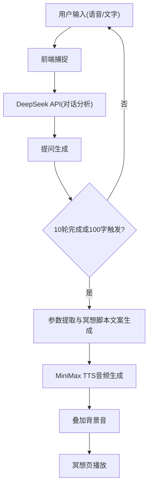

## 1. 产品概述
MindPlan — AI冥想主题提问引导智能体
- 通过结构化多轮提问深度理解用户当下状态，自动生成并播放一段完全个性化的AI冥想音频。
- 像AI编程助手的Plan模式，通过连续提问理清冥想意图、情绪、偏好。极简专注，无聊天记录、无情绪日记、无社交功能。全主动交互，双输入支持。

## 2. 核心功能

### 2.1 功能模块
1. **询问页 (The Inquiry)**: 构建圆环、AI提问区域、双输入区（语音+打字）、提交触发器、快速通道字数计数器
2. **冥想页 (The Meditation)**: 呼吸光晕、计时器、极简控制
3. **我的空间 (My Space)**: 默认时长设置、声音风格设置、背景声音设置、输入偏好设置、关于/重置

### 2.2 页面详情
| 页面名称 | 模块名称 | 功能描述 |
|-----------|-------------|---------------------|
| 询问页 | 构建圆环 | 进度反馈，每完成1轮Q&A，填充1段陶土金色弧光（共10段） |
| 询问页 | AI提问 | DeepSeek API驱动的冥想引导范畴结构化提问 |
| 询问页 | 双输入系统 | 支持打字输入与科大讯飞语音识别输入 |
| 询问页 | 提交系统 | 用户主动轻点提交符，文字上浮融入圆环 |
| 询问页 | 快速通道 | 字数达100时圆环发出暖光脉动，可提前结束提问 |
| 冥想页 | 冥想生成与播放 | 调用MiniMax TTS合成音频，叠加背景音播放 |
| 冥想页 | 冥想播放器 | 中央完整陶土金呼吸光晕，静息呼吸节奏脉动，计时器 |
| 我的空间 | 设置项 | 默认时长、声音风格、背景声音、输入偏好等本地存储设置 |

## 3. 核心流程
用户在询问页回答AI的提问，可以通过文字或语音。经过10轮回答或输入达到100字触发快速通道，提交后提取参数生成冥想脚本文案，调用TTS生成音频并叠加背景音，进入冥想页进行播放。结束后可返回询问页或进入我的空间进行偏好设置。

## 4. 用户界面设计
### 4.1 设计风格
- 极简、专注、温暖、宁静的美学风格。
- 主色调：暖石色、陶土金色、琥珀色、深灰蓝色。
- 字体：温暖手写字体（如用于输入框）、奶油色无衬线字体。
- 动画：淡入淡出、柔和脉动、发光呼吸效果。

### 4.2 页面设计概览
| 页面名称 | 模块名称 | UI元素 |
|-----------|-------------|-------------|
| 询问页 | 构建圆环 | 中央大型圆环，薄金色轮廓，手绘感不规则，陶土金色弧光进度 |
| 询问页 | 输入区 | 海玻璃质感胶囊内发光金线，琥珀色呼吸光晕（语音） |
| 冥想页 | 播放器 | 深灰蓝色渐变背景，暖白微粒，陶土金呼吸光晕 |
| 我的空间 | 设置列表 | 药丸选择器，圆形图标横向滚动 |

### 4.3 响应式
- 移动端优先设计，适配各种移动设备屏幕尺寸（iOS/Android），支持触摸交互优化。